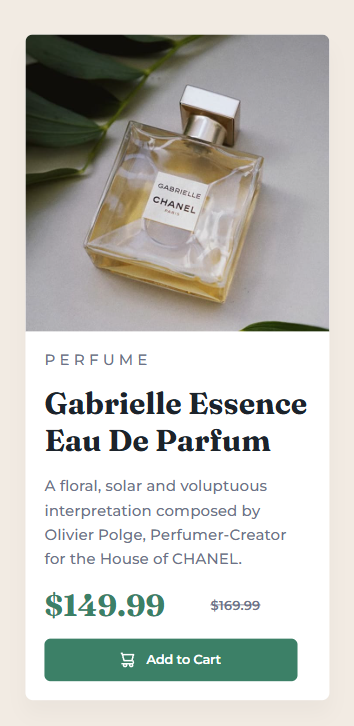

# Frontend Mentor - Product Preview Card

Project developed from a Frontend Mentor challenge.

## Technologies

* HTML5
* CSS3
* Flexbox
* Media Queries

## What I Learned

* Building a responsive card layout with Flexbox
* Switching layouts for desktop and mobile using media queries
* Working with product images for different screen sizes
* Structuring content using semantic HTML
* Styling buttons with icons and hover states
* Creating better spacing and typography for readability

## Preview - Desktop Version

### Mobile Version

